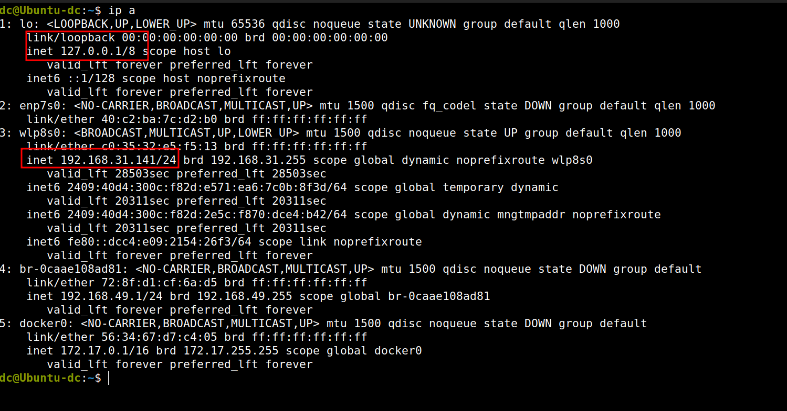
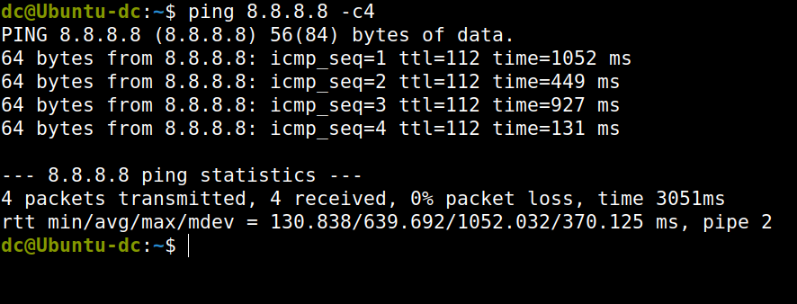
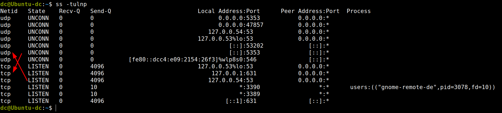
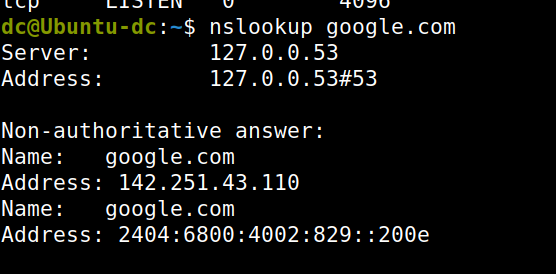
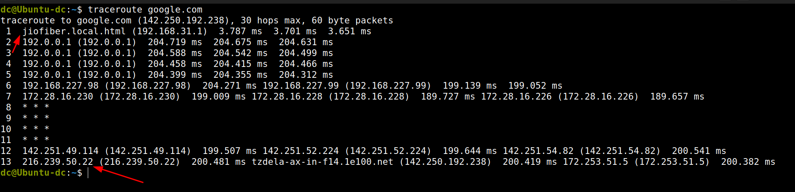
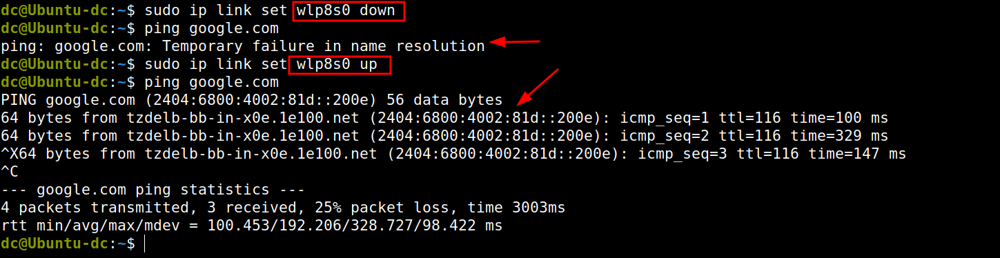

# Network Analysis Report
**Internship Project – TIS**

## 1. IP Addressing
- Command: `ip a`
- Observations:
- Interpretation: System is connected via Wi-Fi with private IP.
 

---

## 2. Connectivity Test
- Command: `ping 8.8.8.8 -c 4`
- Observations:
  - Packet loss: 0%
  - Avg RTT: 639.692 Milliseconds.
- Interpretation: Internet connectivity is stable.

---

## 3. Open Ports & Services
- Command: `ss -tulnp`
- Observations:
  - TCP 22 → SSH service running
  - TCP 80 → Web server active
- Interpretation: System is hosting SSH and HTTP services.

---

## 4. DNS Resolution
- Command: `nslookup google.com`
- Observations:
  - Name:	google.com
  - Address: 142.251.43.110
- Interpretation: DNS resolution is working correctly.
 
---

## 5. Network Path
- Command: `traceroute google.com`
- Observations:
  - 13 hops to destination in which : 1->my local IP  and 13-> Is the  google's destination IP 

  - Latency increases after ISP gateway
- Interpretation: Path is healthy, little minor delays.

---

## 6. Simulated Failure
- Command: `sudo ip link set wlan0 down`
- Observations:
  - Ping fails when we down the service. 
- Interpretation: Network failure simulated successfully.

---

## 7. Conclusion
- System has stable connectivity.
- DNS resolution and routing are functional.
- Services (SSH, HTTP) are active.
- Network failure simulation validated troubleshooting steps.
